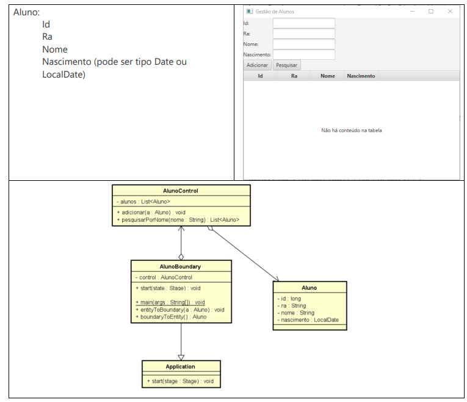

# Tarefa 04

## Exercício 1 || Exercício 19

Exercício - Curso (Boundary, Control e Entity) – Simplificado Usando Java FX 

Crie um CRUD para fazer a manutenção de cursos, contendo o Boundary, o Control e a Entidade (BCE), contendo um botão para adicionar novo curso e outro para pesquisar, conforme layout abaixo:  

Curso:

    - Id
    - Nome
    - Código do Curso
    - Nome do Coordenador
    - Quantidade de alunos

Faça com que o Control guarde a lista de cursos e tenha uma função para gravar novos cursos [ `public void gravar(Curso c)`] e outra função para pesquisar [ `public Curso pesquisar( String parteNome )`] para localizar um curso pelo nome  
Faça com que o Boundary tenha uma instância de Control e acione os métodos gravar e pesquisar desta instância conforme os botões gravar e pesquisar são acionados. 

Dentro do Boundary crie uma função [ `public Curso toEntity()`] que irá gerar e retornar um objeto do tipo Curso com os dados que estiverem na tela. Crie também uma função chamada [ `public void fromEntity(Curso c)` ] que deverá pegar os dados do objeto do tipo Curso informado no parâmetro colocando-os na tela.

## Exercício 2 || Exercício 20

Exercício - Aluno (Boundary, Control, Entity) BCE Simplificado – Usando Java FX

Crie um CRUD para fazer a manutenção de alunos, contendo o Boundary, o Control e a Entidade (BCE - Simplificado) conforme arquivo em anexo:

1. Crie a classe da Entidade com os atributos todos como privado, e os respectivos gets e sets
2. Crie a classe Control contendo um ArrayList do tipo da Entidade, escrevendo os métodos abaixo:

    - a. `void adicionar(<Entidade> e)`, deverá adicionar o objeto do tipo Entidade recebido como parâmetro no ArrayList.

    - b. `<Entidade> pesquisarPorNome(String nome)`, deverá pesquisar no ArrayList para localizar se há um objeto do tipo da Entidade com o campo Nome contendo o texto que foi recebido como o parâmetro, em caso positivo deve retornar o objeto encontrado. Caso não encontre nenhum objeto, deverá retornar null.
 

3. Crie a classe Boundary conforme o diagrama de classe:

    - a. Declare os componentes gráficos necessários conforme o layout abaixo, como sendo variáveis de instância, lembre-se que você não precisa declarar os componentes do tipo Label, desde que os crie diretamente quando forem ser adicionados no GridPane.

    - b. Escreva o código do método start() para que ele crie um objeto do tipo GridPane e posicione os componentes gráficos conforme o layout abaixo.

    - c. Escreva o código do método `<Entidade> boundaryToEntity()` para que gere um novo objeto do
    tipo da Entidade e popule suas propriedades com as informações provenientes dos TextFields

    - d. Escreva o código do método `entityToBoundary (<Entidade> e)` para que leia as propriedades do
    objeto do tipo da Entidade recebido como parâmetro e popule os TextFields com estas
    informações.
    - e. Dentro da função `start()` registre uma função lambda/arrow no botão adicionar para que execute a função `adicionar()` do Control quando for pressionado, e uma função lambda/arrow no botão Pesquisar para que execute a função `pesquisar()` do Control quando este botão for pressionado
